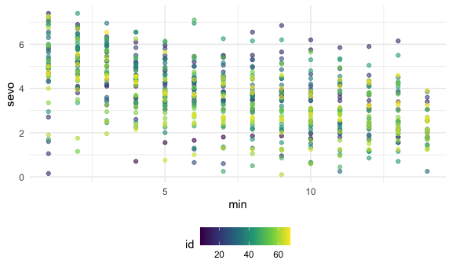
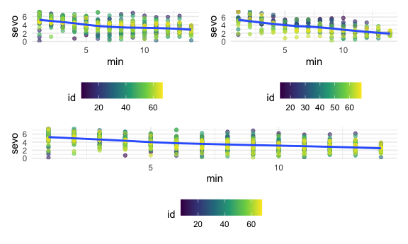
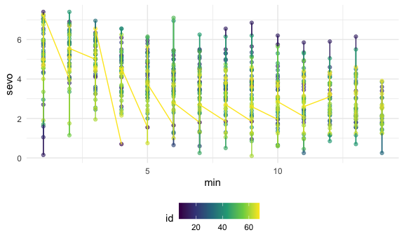
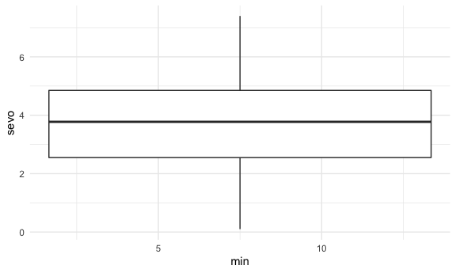
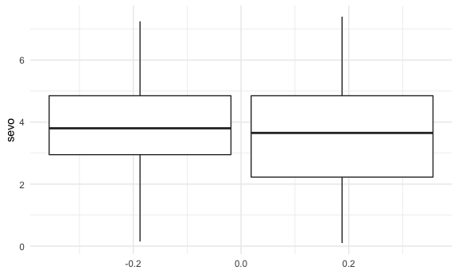
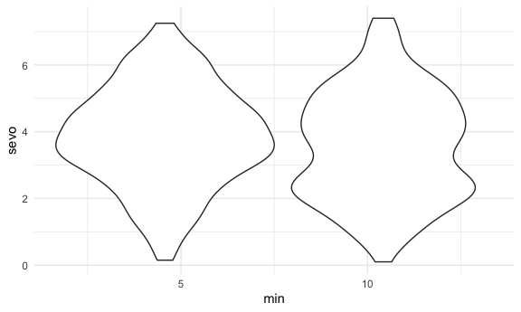

Sevoflurane levels minute-by-minute analysis
================
Jerry Chao
April 20, 2021

    ## ── Attaching packages ───────────────────────────────────────────────────────────── tidyverse 1.3.0 ──

    ## ✓ ggplot2 3.3.2     ✓ purrr   0.3.4
    ## ✓ tibble  3.0.3     ✓ dplyr   1.0.2
    ## ✓ tidyr   1.1.2     ✓ stringr 1.4.0
    ## ✓ readr   1.3.1     ✓ forcats 0.5.0

    ## ── Conflicts ──────────────────────────────────────────────────────────────── tidyverse_conflicts() ──
    ## x dplyr::filter() masks stats::filter()
    ## x dplyr::lag()    masks stats::lag()

``` r
sevo_df = read_csv("./sevo_tidy.csv")
```

    ## Parsed with column specification:
    ## cols(
    ##   id = col_double(),
    ##   discont = col_double(),
    ##   min_1 = col_double(),
    ##   min_2 = col_double(),
    ##   min_3 = col_double(),
    ##   min_4 = col_double(),
    ##   min_5 = col_double(),
    ##   min_6 = col_double(),
    ##   min_7 = col_double(),
    ##   min_8 = col_double(),
    ##   min_9 = col_double(),
    ##   min_10 = col_double(),
    ##   min_11 = col_double(),
    ##   min_12 = col_double(),
    ##   min_13 = col_double(),
    ##   min_14 = col_double(),
    ##   min_15 = col_double(),
    ##   min_16 = col_double(),
    ##   min_17 = col_double()
    ## )

``` r
sevo_df_tidy =
  sevo_df %>% 
    pivot_longer(
      min_1:min_14,
      names_to = "minute",
      names_prefix = "min_",
      values_to = "sevo"
        ) %>% 
    mutate(
      min = as.double(minute)
    ) %>% 
    select(
      id, discont, min, sevo
    )

sevo_df_tidy %>%
  group_by(id, discont) %>% 
  ggplot(aes(x = min, y = sevo, color = id)) +
  geom_point(alpha = .6)
```

    ## Warning: Removed 98 rows containing missing values (geom_point).



``` r
smooth_overall =
sevo_df_tidy %>%
  group_by(id, discont) %>% 
  ggplot(aes(x = min, y = sevo, color = id)) +
  geom_point(alpha = .6) +
  geom_smooth()

smooth_no_discont =
sevo_df_tidy %>%
  filter(
    discont == 0
  ) %>% 
  ggplot(aes(x = min, y = sevo, color = id)) +
  geom_point(alpha = .6) +
  geom_smooth()

smooth_discont =
sevo_df_tidy %>%
  filter(
    discont == 1
  ) %>% 
  ggplot(aes(x = min, y = sevo, color = id)) +
  geom_point(alpha = .6) +
  geom_smooth()

(smooth_no_discont + smooth_discont) / smooth_overall
```

    ## `geom_smooth()` using method = 'loess' and formula 'y ~ x'

    ## Warning: Removed 73 rows containing non-finite values (stat_smooth).

    ## Warning: Removed 73 rows containing missing values (geom_point).

    ## `geom_smooth()` using method = 'loess' and formula 'y ~ x'

    ## Warning: Removed 25 rows containing non-finite values (stat_smooth).

    ## Warning: Removed 25 rows containing missing values (geom_point).

    ## `geom_smooth()` using method = 'loess' and formula 'y ~ x'

    ## Warning: Removed 98 rows containing non-finite values (stat_smooth).

    ## Warning: Removed 98 rows containing missing values (geom_point).



``` r
sevo_df_tidy %>%
  ggplot(aes(x = min, y = sevo, color = id)) +
  geom_point(alpha = .6) +
  geom_line()
```

    ## Warning: Removed 98 rows containing missing values (geom_point).



``` r
sevo_df_tidy %>%
  ggplot(aes(x = min, y = sevo, color = id)) +
  geom_boxplot()
```

    ## Warning: Continuous x aesthetic -- did you forget aes(group=...)?

    ## Warning: Removed 98 rows containing non-finite values (stat_boxplot).



``` r
sevo_df_tidy %>%
  ggplot(aes(group = discont, y = sevo)) +
  geom_boxplot()
```

    ## Warning: Removed 98 rows containing non-finite values (stat_boxplot).



``` r
sevo_df_tidy %>%
  ggplot(aes(group = discont, x = min, y = sevo)) +
  geom_violin()
```

    ## Warning: Removed 98 rows containing non-finite values (stat_ydensity).


